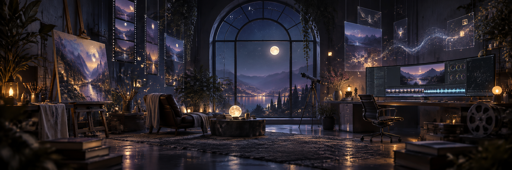

<div align="center">
  
</div>

<br />

<div align="center">

# Katelynn Noah

### Creative technologist · designer who codes · filmmaker · multidisciplinary artist

*I build expressive digital worlds where story, design, and technology meet.*

[](mailto:katenoah.personal@gmail.com)
[](https://github.com/katenoahpersonal-svg?tab=repositories)

</div>

---

## Welcome to my atelier ✦

I'm Kate, a multidisciplinary creative who moves fluidly between **visual design, filmmaking, storytelling, and front-end development**. I turn ideas into immersive experiences—from cinematic edits and brand systems to interactive websites and thoughtful digital tools.

My work begins with feeling, but it doesn't end there. I care about the tiny details that make an experience intuitive, human, and memorable: rhythm, movement, hierarchy, atmosphere, and the story beneath the surface.

```text
DESIGN       → identities, campaigns, interfaces, visual systems
CODE         → responsive experiences, creative front ends, useful tools
FILM         → editing, motion, narrative, emotional pacing
PURPOSE      → technology that feels human and work that carries hope
```

## Selected work

<table>
  <tr>
    <td width="50%" valign="top">
      <h3>✦ Hope Pixel Broadcast</h3>
      <p>A visual-first digital experience shaped through atmosphere, motion, and creative front-end craft.</p>
      <p><a href="https://github.com/katenoahpersonal-svg/Hope-Pixel-Broadcast"><strong>Enter the project →</strong></a></p>
    </td>
    <td width="50%" valign="top">
      <h3>✦ Hope Records</h3>
      <p>A TypeScript project exploring how design systems and storytelling can live together in one experience.</p>
      <p><a href="https://github.com/katenoahpersonal-svg/Hope-Records"><strong>View the repository →</strong></a></p>
    </td>
  </tr>
  <tr>
    <td width="50%" valign="top">
      <h3>✦ Organic Algorithm App</h3>
      <p>A concept-driven web application built to make digital systems feel more intuitive and alive.</p>
      <p><a href="https://github.com/katenoahpersonal-svg/Organic-Algorithm-App"><strong>See how it works →</strong></a></p>
    </td>
    <td width="50%" valign="top">
      <h3>✦ Share Your Story</h3>
      <p>A story-centered digital space designed around voice, connection, and human experience.</p>
      <p><a href="https://github.com/katenoahpersonal-svg/share-your-story"><strong>Explore the project →</strong></a></p>
    </td>
  </tr>
</table>

## The creative toolbox

<div align="center">

[](https://skillicons.dev)

</div>

**Design & direction** · Brand systems, art direction, UI/UX, campaigns, print and digital design  
**Film & motion** · Editing, post-production, motion graphics, livestream production  
**Web & commerce** · HTML, CSS, JavaScript, TypeScript, React, BigCommerce, Shopify, WordPress  
**Growth & storytelling** · Email marketing, Meta Ads, content strategy, visual narratives

## Currently creating

- Building immersive portfolio experiences for **Hope Pixel**
- Exploring the space between cinematic storytelling and interaction design
- Making complex technology feel more beautiful, understandable, and human

## A little constellation of activity

<div align="center">
  
  
</div>

<div align="center">
  
</div>

---

<div align="center">

### Make it useful. Make it beautiful. Make it mean something.

*Thanks for wandering through my little corner of the internet.*

</div>
